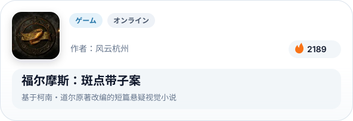
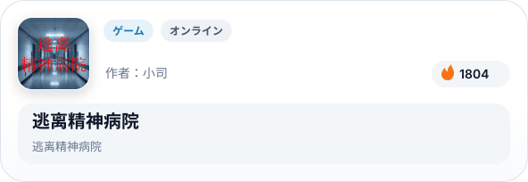
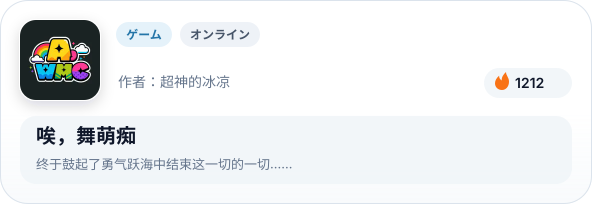
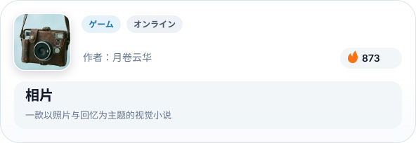
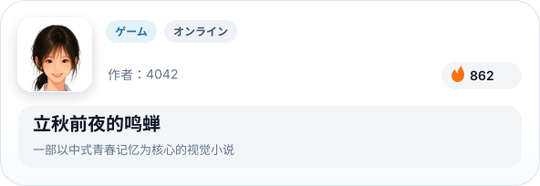
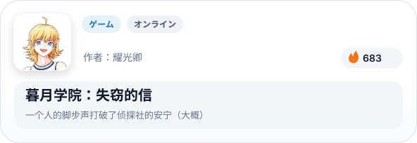
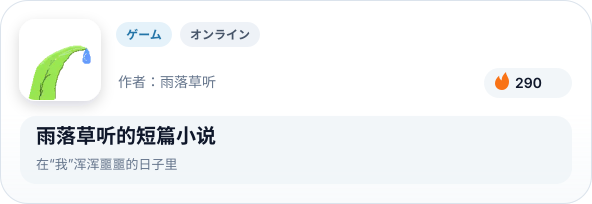
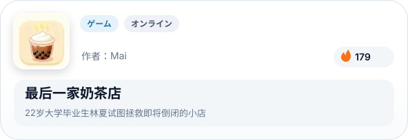

# Konado コナド：ビジュアルノベルフレームワーク

[English](README.md) | [简体中文](README.zh-CN.md) | [繁體中文](README.zh-TW.md) | 日本語 | [한국어](README.ko.md)

 

  
  
  
  
  
  
  
  

 

## 概要

Konado は Godot Engine 用のダイアログ作成ツールキットであり、テンプレートとダイアログマネージャーを備え、ビジュアルノベル、ギャルゲーム、RPG などのストーリー駆動型プロジェクトを迅速に構築するのに役立ちます。

## クイックスタート

[クイックスタートガイド](https://godothub.com/oss/konado/ja/2.4/tutorial/install.html)に従って、数分以内に Konado をセットアップして使用を開始してください。

## ドキュメント

包括的なガイド、API リファレンス、高度なチュートリアルについては、公式プロジェクトウェブサイトをご覧ください：https://godothub.com/oss/konado/ja/2.4/

## コミュニティ

他の Konado ユーザーとつながり、アイデアを共有し、サポートを受けるためにコミュニティに参加してください。以下の方法で参加できます：

- QQ チャンネルディスカッショングループ：[参加する](https://pd.qq.com/g/godot)

- Discord サーバーチャンネル：[参加する](https://discord.com/channels/1378639076747513938/1425084240550166592)

<a href="https://godothub.com">
<picture>
  <source media="(prefers-color-scheme: dark)" srcset="https://legacy.godothub.com/godothub_dark_logo.png">
  <source media="(prefers-color-scheme: light)" srcset="https://legacy.godothub.com/godothub_light_logo.png">
  
</picture>
</a>

## スポンサーサポート

このリンクを通じて私たちの作業をサポートすることを歓迎します：[愛発電スポンサー](https://afdian.com/item/52230b2860a011f083ef52540025c377)、
あなたのスポンサーシップは、私たちが Konado プロジェクトを継続的に改善するのを助けます。

  

## 貢献

Konado に貢献したいですか？参加方法の詳細なガイドラインについては、[CONTRIBUTING.md](./CONTRIBUTING.md) を参照してください。

## 行動規範

このプロジェクトは [行動規範](./CODE_OF_CONDUCT.md) に準拠しています。参加することで、この規範を順守することが期待されます。

## Konado プロジェクトチーム

- [DSOE1024](https://github.com/DSOE1024)
- [putyk](https://github.com/putyk)
- [moluopro](https://github.com/moluopro)
- [ioniccrystal](https://github.com/ioniccrystal)
- [fangchu](https://github.com/fangchudark)

## 貢献者

以下の方々がこのプロジェクトに貢献しました：

<a href="https://github.com/godothub/konado/graphs/contributors" target="_blank">
  <picture>
	<source media="(prefers-color-scheme: dark)" srcset="https://contrib.rocks/image?repo=godothub/konado&theme=dark" />
	<source media="(prefers-color-scheme: light)" srcset="https://contrib.rocks/image?repo=godothub/konado" />
	
  </picture>
</a>

<!-- BEGIN MADE BY KONADO -->
## Konado で制作

> [GodotHub](https://godothub.com/game/visual-novel) の Konado 制作作品です。

<a href="https://godothub.com/asset/m07csjky18z5o6v"><picture><source media="(max-width: 767px) and (prefers-color-scheme: dark)" srcset="./assets/made-by-konado/ja/dark/m07csjky18z5o6v.svg" width="1200"><source media="(max-width: 767px)" srcset="./assets/made-by-konado/ja/light/m07csjky18z5o6v.svg" width="1200"><source media="(prefers-color-scheme: dark)" srcset="./assets/made-by-konado/ja/dark/m07csjky18z5o6v.svg"></picture></a>&emsp;<a href="https://godothub.com/asset/91gnqrsmv683edj"><picture><source media="(max-width: 767px) and (prefers-color-scheme: dark)" srcset="./assets/made-by-konado/ja/dark/91gnqrsmv683edj.svg" width="1200"><source media="(max-width: 767px)" srcset="./assets/made-by-konado/ja/light/91gnqrsmv683edj.svg" width="1200"><source media="(prefers-color-scheme: dark)" srcset="./assets/made-by-konado/ja/dark/91gnqrsmv683edj.svg"></picture></a>

<a href="https://godothub.com/asset/lz94hqgxiqm6i38"><picture><source media="(max-width: 767px) and (prefers-color-scheme: dark)" srcset="./assets/made-by-konado/ja/dark/lz94hqgxiqm6i38.svg" width="1200"><source media="(max-width: 767px)" srcset="./assets/made-by-konado/ja/light/lz94hqgxiqm6i38.svg" width="1200"><source media="(prefers-color-scheme: dark)" srcset="./assets/made-by-konado/ja/dark/lz94hqgxiqm6i38.svg"></picture></a>&emsp;<a href="https://godothub.com/asset/7jpmwjsd7t74mtk"><picture><source media="(max-width: 767px) and (prefers-color-scheme: dark)" srcset="./assets/made-by-konado/ja/dark/7jpmwjsd7t74mtk.svg" width="1200"><source media="(max-width: 767px)" srcset="./assets/made-by-konado/ja/light/7jpmwjsd7t74mtk.svg" width="1200"><source media="(prefers-color-scheme: dark)" srcset="./assets/made-by-konado/ja/dark/7jpmwjsd7t74mtk.svg"></picture></a>

<a href="https://godothub.com/asset/wnktmumcg6cvitt"><picture><source media="(max-width: 767px) and (prefers-color-scheme: dark)" srcset="./assets/made-by-konado/ja/dark/wnktmumcg6cvitt.svg" width="1200"><source media="(max-width: 767px)" srcset="./assets/made-by-konado/ja/light/wnktmumcg6cvitt.svg" width="1200"><source media="(prefers-color-scheme: dark)" srcset="./assets/made-by-konado/ja/dark/wnktmumcg6cvitt.svg"></picture></a>&emsp;<a href="https://godothub.com/asset/wrz7qs36ntsnxqo"><picture><source media="(max-width: 767px) and (prefers-color-scheme: dark)" srcset="./assets/made-by-konado/ja/dark/wrz7qs36ntsnxqo.svg" width="1200"><source media="(max-width: 767px)" srcset="./assets/made-by-konado/ja/light/wrz7qs36ntsnxqo.svg" width="1200"><source media="(prefers-color-scheme: dark)" srcset="./assets/made-by-konado/ja/dark/wrz7qs36ntsnxqo.svg"></picture></a>

<a href="https://godothub.com/asset/i5ao33yuq8tr9rz"><picture><source media="(max-width: 767px) and (prefers-color-scheme: dark)" srcset="./assets/made-by-konado/ja/dark/i5ao33yuq8tr9rz.svg" width="1200"><source media="(max-width: 767px)" srcset="./assets/made-by-konado/ja/light/i5ao33yuq8tr9rz.svg" width="1200"><source media="(prefers-color-scheme: dark)" srcset="./assets/made-by-konado/ja/dark/i5ao33yuq8tr9rz.svg"></picture></a>&emsp;<a href="https://godothub.com/asset/8xibg3dzqcui7py"><picture><source media="(max-width: 767px) and (prefers-color-scheme: dark)" srcset="./assets/made-by-konado/ja/dark/8xibg3dzqcui7py.svg" width="1200"><source media="(max-width: 767px)" srcset="./assets/made-by-konado/ja/light/8xibg3dzqcui7py.svg" width="1200"><source media="(prefers-color-scheme: dark)" srcset="./assets/made-by-konado/ja/dark/8xibg3dzqcui7py.svg"></picture></a>

<a href="https://godothub.com/asset/gm1tvpxth4v41ql"><picture><source media="(max-width: 767px) and (prefers-color-scheme: dark)" srcset="./assets/made-by-konado/ja/dark/gm1tvpxth4v41ql.svg" width="1200"><source media="(max-width: 767px)" srcset="./assets/made-by-konado/ja/light/gm1tvpxth4v41ql.svg" width="1200"><source media="(prefers-color-scheme: dark)" srcset="./assets/made-by-konado/ja/dark/gm1tvpxth4v41ql.svg"></picture></a>&emsp;<a href="https://godothub.com/asset/lva4zsfmzcflpjv"><picture><source media="(max-width: 767px) and (prefers-color-scheme: dark)" srcset="./assets/made-by-konado/ja/dark/lva4zsfmzcflpjv.svg" width="1200"><source media="(max-width: 767px)" srcset="./assets/made-by-konado/ja/light/lva4zsfmzcflpjv.svg" width="1200"><source media="(prefers-color-scheme: dark)" srcset="./assets/made-by-konado/ja/dark/lva4zsfmzcflpjv.svg"></picture></a>

<!-- END MADE BY KONADO -->

## オープンソースライセンス

Konado は BSD 3-Clause License の下で配布されています。詳細な条件については [LICENSE](./LICENSE) ファイルを参照してください。
