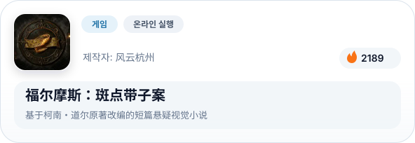
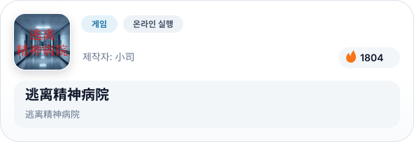
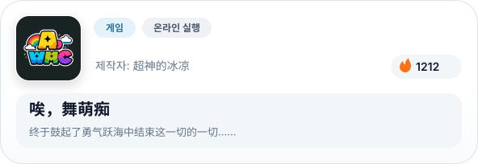
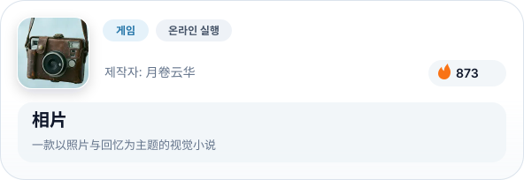
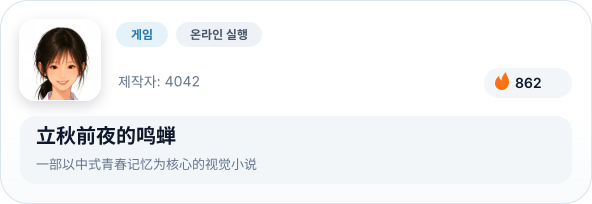
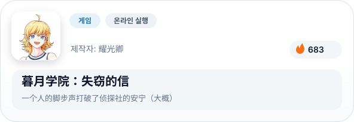
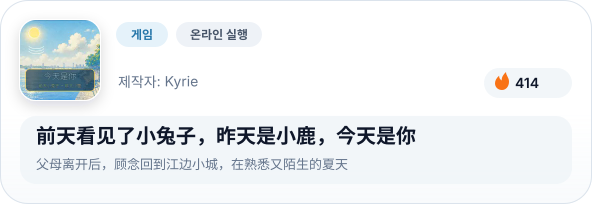
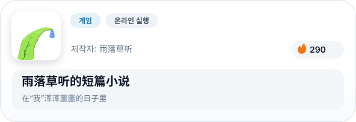
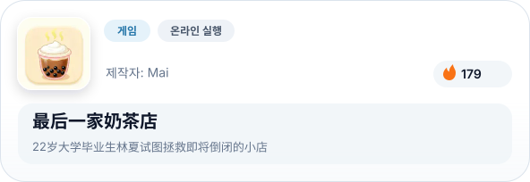

# Konado 코나도: 비주얼 노벨 프레임워크

[English](README.md) | [简体中文](README.zh-CN.md) | [繁體中文](README.zh-TW.md) | [日本語](README.ja.md) | 한국어

 

  
  
  
  
  
  
  
  

 

## 개요

Konado는 Godot Engine용 대화 생성 도구킷으로, 템플릿과 대화 관리자를 제공하여 비주얼 노벨, 갤 게임, RPG 및 기타 스토리 기반 프로젝트를 빠르게 구축하는 데 도움을 줍니다.

## 빠른 시작

[빠른 시작 가이드](https://godothub.com/oss/konado/ko/2.4/tutorial/install.html)를 따라 몇 분 만에 Konado를 설정하고 사용하기 시작하세요.

## 문서

종합 가이드, API 참조 및 고급 튜토리얼을 보려면 공식 프로젝트 웹사이트를 방문하세요: https://godothub.com/oss/konado/ko/2.4/

## 커뮤니티

다른 Konado 사용자들과 연결하고, 아이디어를 공유하고, 지원을 받기 위해 커뮤니티에 가입하세요. 다음과 같은 방법으로 참여할 수 있습니다:

- QQ 채널 토론 그룹: [가입하기](https://pd.qq.com/g/godot)

- Discord 서버 채널: [가입하기](https://discord.com/channels/1378639076747513938/1425084240550166592)

<a href="https://godothub.com">
<picture>
  <source media="(prefers-color-scheme: dark)" srcset="https://legacy.godothub.com/godothub_dark_logo.png">
  <source media="(prefers-color-scheme: light)" srcset="https://legacy.godothub.com/godothub_light_logo.png">
  
</picture>
</a>

## 스폰서 지원

이 링크를 통해 우리의 작업을 지원해 주시기를 환영합니다：[愛發電 스폰서](https://afdian.com/item/52230b2860a011f083ef52540025c377)、
귀하의 스폰서는 우리가 Konado 프로젝트를 지속적으로 개선하는 데 도움이 됩니다。

  

## 기여

Konado에 기여하고 싶으신가요? 참여 방법에 대한 자세한 가이드라인은 [CONTRIBUTING.md](./CONTRIBUTING.md)를 참조하세요.

## 행동 강령

이 프로젝트는 [행동 강령](./CODE_OF_CONDUCT.md)을 준수합니다. 참여함으로써 이 규정을 준수할 것으로 기대됩니다.

## Konado 프로젝트 팀

- [DSOE1024](https://github.com/DSOE1024)
- [putyk](https://github.com/putyk)
- [moluopro](https://github.com/moluopro)
- [ioniccrystal](https://github.com/ioniccrystal)
- [fangchu](https://github.com/fangchudark)

## 기여자

다음 분들이 이 프로젝트에 기여했습니다:

<a href="https://github.com/godothub/konado/graphs/contributors" target="_blank">
  <picture>
	<source media="(prefers-color-scheme: dark)" srcset="https://contrib.rocks/image?repo=godothub/konado&theme=dark" />
	<source media="(prefers-color-scheme: light)" srcset="https://contrib.rocks/image?repo=godothub/konado" />
	
  </picture>
</a>

<!-- BEGIN MADE BY KONADO -->
## Konado로 제작

> [GodotHub](https://godothub.com/game/visual-novel)의 Konado 제작 작품입니다.

<a href="https://godothub.com/asset/m07csjky18z5o6v"><picture><source media="(max-width: 767px) and (prefers-color-scheme: dark)" srcset="./assets/made-by-konado/ko/dark/m07csjky18z5o6v.svg" width="1200"><source media="(max-width: 767px)" srcset="./assets/made-by-konado/ko/light/m07csjky18z5o6v.svg" width="1200"><source media="(prefers-color-scheme: dark)" srcset="./assets/made-by-konado/ko/dark/m07csjky18z5o6v.svg"></picture></a>&emsp;<a href="https://godothub.com/asset/91gnqrsmv683edj"><picture><source media="(max-width: 767px) and (prefers-color-scheme: dark)" srcset="./assets/made-by-konado/ko/dark/91gnqrsmv683edj.svg" width="1200"><source media="(max-width: 767px)" srcset="./assets/made-by-konado/ko/light/91gnqrsmv683edj.svg" width="1200"><source media="(prefers-color-scheme: dark)" srcset="./assets/made-by-konado/ko/dark/91gnqrsmv683edj.svg"></picture></a>

<a href="https://godothub.com/asset/lz94hqgxiqm6i38"><picture><source media="(max-width: 767px) and (prefers-color-scheme: dark)" srcset="./assets/made-by-konado/ko/dark/lz94hqgxiqm6i38.svg" width="1200"><source media="(max-width: 767px)" srcset="./assets/made-by-konado/ko/light/lz94hqgxiqm6i38.svg" width="1200"><source media="(prefers-color-scheme: dark)" srcset="./assets/made-by-konado/ko/dark/lz94hqgxiqm6i38.svg"></picture></a>&emsp;<a href="https://godothub.com/asset/7jpmwjsd7t74mtk"><picture><source media="(max-width: 767px) and (prefers-color-scheme: dark)" srcset="./assets/made-by-konado/ko/dark/7jpmwjsd7t74mtk.svg" width="1200"><source media="(max-width: 767px)" srcset="./assets/made-by-konado/ko/light/7jpmwjsd7t74mtk.svg" width="1200"><source media="(prefers-color-scheme: dark)" srcset="./assets/made-by-konado/ko/dark/7jpmwjsd7t74mtk.svg"></picture></a>

<a href="https://godothub.com/asset/wnktmumcg6cvitt"><picture><source media="(max-width: 767px) and (prefers-color-scheme: dark)" srcset="./assets/made-by-konado/ko/dark/wnktmumcg6cvitt.svg" width="1200"><source media="(max-width: 767px)" srcset="./assets/made-by-konado/ko/light/wnktmumcg6cvitt.svg" width="1200"><source media="(prefers-color-scheme: dark)" srcset="./assets/made-by-konado/ko/dark/wnktmumcg6cvitt.svg"></picture></a>&emsp;<a href="https://godothub.com/asset/wrz7qs36ntsnxqo"><picture><source media="(max-width: 767px) and (prefers-color-scheme: dark)" srcset="./assets/made-by-konado/ko/dark/wrz7qs36ntsnxqo.svg" width="1200"><source media="(max-width: 767px)" srcset="./assets/made-by-konado/ko/light/wrz7qs36ntsnxqo.svg" width="1200"><source media="(prefers-color-scheme: dark)" srcset="./assets/made-by-konado/ko/dark/wrz7qs36ntsnxqo.svg"></picture></a>

<a href="https://godothub.com/asset/i5ao33yuq8tr9rz"><picture><source media="(max-width: 767px) and (prefers-color-scheme: dark)" srcset="./assets/made-by-konado/ko/dark/i5ao33yuq8tr9rz.svg" width="1200"><source media="(max-width: 767px)" srcset="./assets/made-by-konado/ko/light/i5ao33yuq8tr9rz.svg" width="1200"><source media="(prefers-color-scheme: dark)" srcset="./assets/made-by-konado/ko/dark/i5ao33yuq8tr9rz.svg"></picture></a>&emsp;<a href="https://godothub.com/asset/8xibg3dzqcui7py"><picture><source media="(max-width: 767px) and (prefers-color-scheme: dark)" srcset="./assets/made-by-konado/ko/dark/8xibg3dzqcui7py.svg" width="1200"><source media="(max-width: 767px)" srcset="./assets/made-by-konado/ko/light/8xibg3dzqcui7py.svg" width="1200"><source media="(prefers-color-scheme: dark)" srcset="./assets/made-by-konado/ko/dark/8xibg3dzqcui7py.svg"></picture></a>

<a href="https://godothub.com/asset/gm1tvpxth4v41ql"><picture><source media="(max-width: 767px) and (prefers-color-scheme: dark)" srcset="./assets/made-by-konado/ko/dark/gm1tvpxth4v41ql.svg" width="1200"><source media="(max-width: 767px)" srcset="./assets/made-by-konado/ko/light/gm1tvpxth4v41ql.svg" width="1200"><source media="(prefers-color-scheme: dark)" srcset="./assets/made-by-konado/ko/dark/gm1tvpxth4v41ql.svg"></picture></a>&emsp;<a href="https://godothub.com/asset/lva4zsfmzcflpjv"><picture><source media="(max-width: 767px) and (prefers-color-scheme: dark)" srcset="./assets/made-by-konado/ko/dark/lva4zsfmzcflpjv.svg" width="1200"><source media="(max-width: 767px)" srcset="./assets/made-by-konado/ko/light/lva4zsfmzcflpjv.svg" width="1200"><source media="(prefers-color-scheme: dark)" srcset="./assets/made-by-konado/ko/dark/lva4zsfmzcflpjv.svg"></picture></a>

<!-- END MADE BY KONADO -->

## 오픈 소스 라이선스

Konado는 BSD 3-Clause License에 따라 배포됩니다. 자세한 조건은 [LICENSE](./LICENSE) 파일을 참조하세요.
