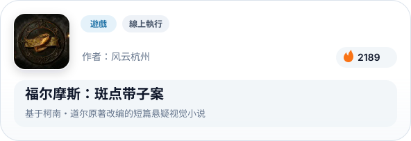
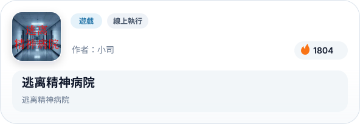
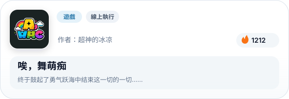
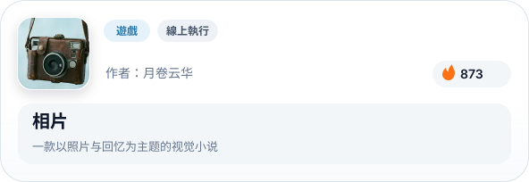
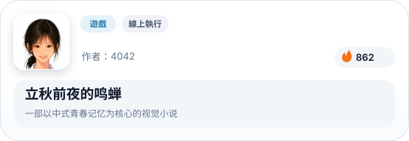
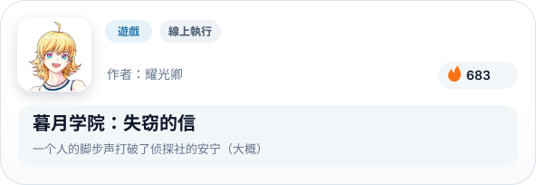
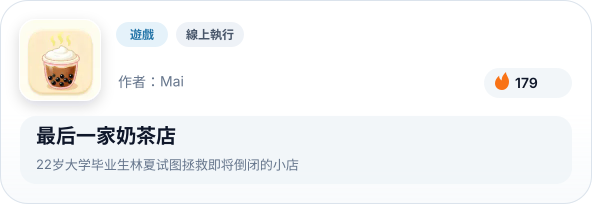

# Konado 可娜多：視覺小說框架

[English](README.md) | [简体中文](README.zh-CN.md) | 繁體中文 | [日本語](README.ja.md) | [한국어](README.ko.md)

 

  
  
  
  
  
  
  
  

 

## 簡介

Konado 是 Godot 引擎的對話創建工具包，提供模板和對話管理器，幫助您快速構建視覺小說、GalGame、RPG 和其他故事驅動的專案。

## 快速入門

請參閱 [快速入門](https://godothub.com/oss/konado/tc/2.4/tutorial/install.html) 文件，瞭解如何快速開始使用 Konado。

## 文件

歡迎造訪我們的專案網站：https://godothub.com/oss/konado/tc/2.4/ 取得更詳盡的文件與教學。

## 社群

歡迎加入我們的社群交流頻道，與其他 Konado 使用者交流經驗、分享創意。您可透過以下管道加入：

- 加入我們的 QQ 頻道討論群：[點擊加入](https://pd.qq.com/g/godot)

- 加入我們的 Discord 社群頻道：[點擊加入](https://discord.com/channels/1378639076747513938/1425084240550166592)

<a href="https://godothub.com">
<picture>
  <source media="(prefers-color-scheme: dark)" srcset="https://legacy.godothub.com/godothub_dark_logo.png">
  <source media="(prefers-color-scheme: light)" srcset="https://legacy.godothub.com/godothub_light_logo.png">
  
</picture>
</a>

## 贊助支持

歡迎透過此連結支持我們的工作：[愛發電贊助](https://afdian.com/item/52230b2860a011f083ef52540025c377)，
您的贊助將幫助我們持續完善 Konado 專案。

  

## 參與開發

詳細貢獻指南請參閱 [CONTRIBUTING.md](./CONTRIBUTING.md)。

## 行為準則

本專案遵循 [Code of Conduct](./CODE_OF_CONDUCT.md) 行為準則。

## Konado 專案團隊

- [DSOE1024](https://github.com/DSOE1024)
- [putyk](https://github.com/putyk)
- [moluopro](https://github.com/moluopro)
- [ioniccrystal](https://github.com/ioniccrystal)
- [fangchu](https://github.com/fangchudark)

## 專案貢獻者

以下成員為本專案做出了貢獻：

<a href="https://github.com/godothub/konado/graphs/contributors" target="_blank">
  <picture>
	<source media="(prefers-color-scheme: dark)" srcset="https://contrib.rocks/image?repo=godothub/konado&theme=dark" />
	<source media="(prefers-color-scheme: light)" srcset="https://contrib.rocks/image?repo=godothub/konado" />
	
  </picture>
</a>

<!-- BEGIN MADE BY KONADO -->
## 使用 Konado 製作

> 來自 [GodotHub](https://godothub.com/game/visual-novel) 的 Konado 作品展示。

<a href="https://godothub.com/asset/m07csjky18z5o6v"><picture><source media="(max-width: 767px) and (prefers-color-scheme: dark)" srcset="./assets/made-by-konado/zh-TW/dark/m07csjky18z5o6v.svg" width="1200"><source media="(max-width: 767px)" srcset="./assets/made-by-konado/zh-TW/light/m07csjky18z5o6v.svg" width="1200"><source media="(prefers-color-scheme: dark)" srcset="./assets/made-by-konado/zh-TW/dark/m07csjky18z5o6v.svg"></picture></a>&emsp;<a href="https://godothub.com/asset/91gnqrsmv683edj"><picture><source media="(max-width: 767px) and (prefers-color-scheme: dark)" srcset="./assets/made-by-konado/zh-TW/dark/91gnqrsmv683edj.svg" width="1200"><source media="(max-width: 767px)" srcset="./assets/made-by-konado/zh-TW/light/91gnqrsmv683edj.svg" width="1200"><source media="(prefers-color-scheme: dark)" srcset="./assets/made-by-konado/zh-TW/dark/91gnqrsmv683edj.svg"></picture></a>

<a href="https://godothub.com/asset/lz94hqgxiqm6i38"><picture><source media="(max-width: 767px) and (prefers-color-scheme: dark)" srcset="./assets/made-by-konado/zh-TW/dark/lz94hqgxiqm6i38.svg" width="1200"><source media="(max-width: 767px)" srcset="./assets/made-by-konado/zh-TW/light/lz94hqgxiqm6i38.svg" width="1200"><source media="(prefers-color-scheme: dark)" srcset="./assets/made-by-konado/zh-TW/dark/lz94hqgxiqm6i38.svg"></picture></a>&emsp;<a href="https://godothub.com/asset/7jpmwjsd7t74mtk"><picture><source media="(max-width: 767px) and (prefers-color-scheme: dark)" srcset="./assets/made-by-konado/zh-TW/dark/7jpmwjsd7t74mtk.svg" width="1200"><source media="(max-width: 767px)" srcset="./assets/made-by-konado/zh-TW/light/7jpmwjsd7t74mtk.svg" width="1200"><source media="(prefers-color-scheme: dark)" srcset="./assets/made-by-konado/zh-TW/dark/7jpmwjsd7t74mtk.svg"></picture></a>

<a href="https://godothub.com/asset/wnktmumcg6cvitt"><picture><source media="(max-width: 767px) and (prefers-color-scheme: dark)" srcset="./assets/made-by-konado/zh-TW/dark/wnktmumcg6cvitt.svg" width="1200"><source media="(max-width: 767px)" srcset="./assets/made-by-konado/zh-TW/light/wnktmumcg6cvitt.svg" width="1200"><source media="(prefers-color-scheme: dark)" srcset="./assets/made-by-konado/zh-TW/dark/wnktmumcg6cvitt.svg"></picture></a>&emsp;<a href="https://godothub.com/asset/wrz7qs36ntsnxqo"><picture><source media="(max-width: 767px) and (prefers-color-scheme: dark)" srcset="./assets/made-by-konado/zh-TW/dark/wrz7qs36ntsnxqo.svg" width="1200"><source media="(max-width: 767px)" srcset="./assets/made-by-konado/zh-TW/light/wrz7qs36ntsnxqo.svg" width="1200"><source media="(prefers-color-scheme: dark)" srcset="./assets/made-by-konado/zh-TW/dark/wrz7qs36ntsnxqo.svg"></picture></a>

<a href="https://godothub.com/asset/i5ao33yuq8tr9rz"><picture><source media="(max-width: 767px) and (prefers-color-scheme: dark)" srcset="./assets/made-by-konado/zh-TW/dark/i5ao33yuq8tr9rz.svg" width="1200"><source media="(max-width: 767px)" srcset="./assets/made-by-konado/zh-TW/light/i5ao33yuq8tr9rz.svg" width="1200"><source media="(prefers-color-scheme: dark)" srcset="./assets/made-by-konado/zh-TW/dark/i5ao33yuq8tr9rz.svg"></picture></a>&emsp;<a href="https://godothub.com/asset/8xibg3dzqcui7py"><picture><source media="(max-width: 767px) and (prefers-color-scheme: dark)" srcset="./assets/made-by-konado/zh-TW/dark/8xibg3dzqcui7py.svg" width="1200"><source media="(max-width: 767px)" srcset="./assets/made-by-konado/zh-TW/light/8xibg3dzqcui7py.svg" width="1200"><source media="(prefers-color-scheme: dark)" srcset="./assets/made-by-konado/zh-TW/dark/8xibg3dzqcui7py.svg"></picture></a>

<a href="https://godothub.com/asset/gm1tvpxth4v41ql"><picture><source media="(max-width: 767px) and (prefers-color-scheme: dark)" srcset="./assets/made-by-konado/zh-TW/dark/gm1tvpxth4v41ql.svg" width="1200"><source media="(max-width: 767px)" srcset="./assets/made-by-konado/zh-TW/light/gm1tvpxth4v41ql.svg" width="1200"><source media="(prefers-color-scheme: dark)" srcset="./assets/made-by-konado/zh-TW/dark/gm1tvpxth4v41ql.svg"></picture></a>&emsp;<a href="https://godothub.com/asset/lva4zsfmzcflpjv"><picture><source media="(max-width: 767px) and (prefers-color-scheme: dark)" srcset="./assets/made-by-konado/zh-TW/dark/lva4zsfmzcflpjv.svg" width="1200"><source media="(max-width: 767px)" srcset="./assets/made-by-konado/zh-TW/light/lva4zsfmzcflpjv.svg" width="1200"><source media="(prefers-color-scheme: dark)" srcset="./assets/made-by-konado/zh-TW/dark/lva4zsfmzcflpjv.svg"></picture></a>

<!-- END MADE BY KONADO -->

## 開放原始碼授權條款

Konado 專案採用 BSD 3-條款授權條款，詳細條款請參閱 [LICENSE](./LICENSE) 檔案。
