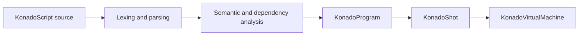

# Dialogue Runtime Data

Konado does not interpret KonadoScript source line by line at runtime. Importing or saving a `.ks` file compiles it into a small set of runtime data types with explicit responsibilities.

## KonadoShot

`KonadoShot` represents one loadable story shot. It records the source path, shot identifier, resource dependencies, and locale overlay, and owns the sole executable artifact: `KonadoProgram`. Applications normally do not create it manually; the editor and runtime loader keep it up to date.

## KonadoProgram

`KonadoProgram` is a compact, read-only instruction program. It stores constant pools, opcodes, operands, control-flow positions, stable instruction keys, and source lines. The runtime executes these arrays by program counter instead of allocating legacy per-line dialogue objects.

## KonadoInstruction

`KonadoInstruction` is a read-only view of one instruction. It does not copy the underlying data and supports debugging, editor navigation, and .NET integration. Game code should normally drive a shot through `KonadoDialogueManager` rather than iterate instructions itself.

## Execution pipeline

This design gives compile-time diagnostics, dependency validation, rollback, and localization one stable instruction model while avoiding repeated source parsing at runtime.
