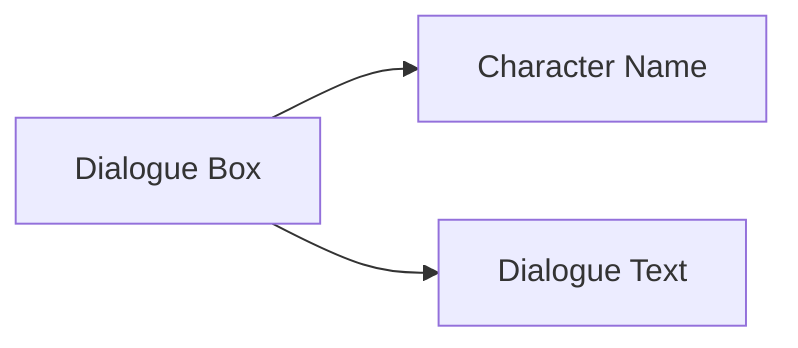

# Ordinary Dialogue

## Description


Ordinary dialogue is a common interaction method in games. It is used for communication between characters and players, presenting dialogue content through the character name and dialogue text.

## Syntax

```text
[actor identifier, variable, or text label] "dialogue text" [voice tag] [parameter=value ...]
```

## Parameters

| Parameter | Required | Example | Description |
|------|------|------|------|
| Speaker | Yes | `alice`, `$speaker`, or `"Narrator"` | A static actor, a variable containing an actor ID, or a text label |
| Dialogue text | Yes | `Hello, my name is Alice!` | What the character says |
| Voice tag | No | `alice_intro_01` | Optional tag used to identify the voice file |
| `speed` | No | `[speed=1.5]` | Typing-speed multiplier for this line; must be greater than `0` |
| `interval` | No | `[interval=0.03]` | Delay per character in seconds; cannot be combined with `speed` |

## Example

```text
# Ordinary dialogue
alice "Hello, my name is Alice!" alice_intro_01

# Adjust the typing speed for one line
alice "This line appears faster." [speed=1.5]

# Text label; no matching actor is required
"Narrator" "The storm was growing stronger..."

# Select an actor through a temporary or persistent variable
set $speaker "alice"
set %current_speaker "alice"
$speaker "A variable selected the speaker for this line."
%current_speaker "Persistent variables can also provide the speaker."

# Interpolate variables in a text label
set $guest_index 2
"Guest $guest_index" "It is nice to meet you."
```

A bare name always denotes an actor identifier, allowing the editor to complete, validate, navigate, and rename it. `$name` and `%name` always denote temporary and persistent variables whose values must be non-empty string actor IDs. A missing or mistyped variable fails at runtime instead of falling back to a same-named string. A quoted speaker is always localizable text and supports `$name` and `%name` interpolation; use an empty string to hide the label. A missing interpolation variable is left unchanged and produces a warning. The legacy `"alice" "..."` form remains valid; when its resolved label matches an actor ID, runtime auto-highlighting still works.
