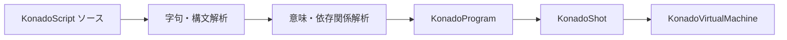

# 会話ランタイムデータ

KonadoScript のソースは実行時に 1 行ずつ解釈されません。`.ks` ファイルをインポートまたは保存すると、責務が明確なランタイムデータへコンパイルされます。

## KonadoShot

`KonadoShot` は読み込み可能な 1 つのストーリーショットです。ソースパス、ショット ID、リソース依存関係、ロケールオーバーレイを記録し、唯一の実行形式である `KonadoProgram` を保持します。通常は手動で作成せず、エディターとランタイムローダーが更新します。

## KonadoProgram

`KonadoProgram` はコンパクトな読み取り専用命令プログラムです。定数プール、オペコード、オペランド、制御フロー位置、安定命令キー、ソース行を保持します。ランタイムは旧式の行単位会話オブジェクトを生成せず、プログラムカウンターで配列を直接実行します。

## KonadoInstruction

`KonadoInstruction` は 1 命令の読み取り専用ビューです。基礎データをコピーせず、デバッグ、エディター移動、.NET 連携に利用できます。通常のゲームコードは命令を直接走査せず、`KonadoDialogueManager` からショットを実行してください。

## 実行フロー

この構造により、コンパイル時診断、依存関係検証、ロールバック、ローカライズが同じ安定命令モデルを共有し、実行時の再解析を避けられます。
