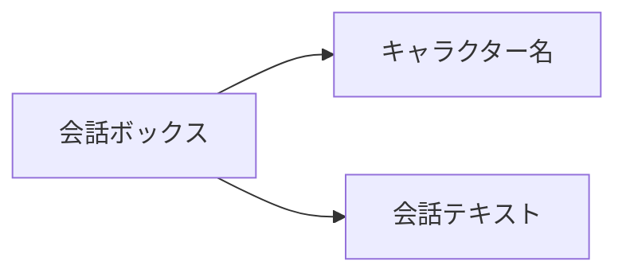

# 通常会話

## 機能説明


通常会話は、ゲームでよく使われるインタラクション方式です。キャラクターとプレイヤーのやり取りに使われ、キャラクター名と会話テキストによって会話内容を表示します。

## 構文

```text
[アクター識別子、変数、または署名テキスト] "会話テキスト" [ボイスタグ] [パラメーター=値 ...]
```

## パラメーター

| パラメーター | 必須 | 例 | 説明 |
|------|------|------|------|
| 話者 | はい | `alice`、`$speaker`、または `"ナレーター"` | 静的アクター、アクター ID を保持する変数、またはテキスト署名 |
| 会話テキスト | はい | `こんにちは、私はアリスです！` | キャラクターが話す内容 |
| ボイスタグ | いいえ | `alice_intro_01` | ボイスファイルを識別するための任意タグ |
| `speed` | いいえ | `[speed=1.5]` | この行のタイプ速度倍率。`0` より大きい値を指定します |
| `interval` | いいえ | `[interval=0.03]` | 1 文字ごとの表示間隔（秒）。`speed` と同時には指定できません |

## 例

```text
# 通常会話
alice "こんにちは、私はアリスです！" alice_intro_01

# この行だけタイプ速度を変更
alice "この行はより速く表示されます。" [speed=1.5]

# 対応するアクターを必要としないテキスト署名
"ナレーター" "嵐はますます激しくなっていた..."

# 一時変数または永続変数でアクターを選択
set $speaker "alice"
set %current_speaker "alice"
$speaker "この行の話者は変数で選択されています。"
%current_speaker "永続変数も話者として利用できます。"

# 署名テキスト内の変数展開
set $guest_index 2
"ゲスト $guest_index" "お会いできてうれしいです。"
```

引用符のない名前は常にアクター識別子であり、エディターの補完、検証、移動、名前変更の対象になります。`$name` と `%name` は常に一時変数と永続変数で、値は空でない文字列のアクター ID でなければなりません。変数が存在しない場合や型が不正な場合は実行時エラーとなり、同名文字列へフォールバックしません。引用符付きの話者は常にローカライズ可能なテキストで、`$name` と `%name` の展開に対応します。空文字列を指定すると署名を非表示にできます。展開する変数が存在しない場合は元のプレースホルダーを残して警告を出力します。従来の `"alice" "..."` 形式も引き続き使用でき、展開後の署名がアクター ID と一致すれば自動ハイライトも機能します。
