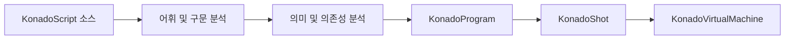

# 대화 런타임 데이터

KonadoScript 소스는 런타임에 한 줄씩 해석되지 않습니다. `.ks` 파일을 가져오거나 저장하면 역할이 명확한 런타임 데이터로 컴파일됩니다.

## KonadoShot

`KonadoShot`은 로드 가능한 하나의 스토리 샷입니다. 소스 경로, 샷 식별자, 리소스 의존성, 로케일 오버레이를 기록하며 유일한 실행 산출물인 `KonadoProgram`을 보유합니다. 일반적으로 직접 만들 필요가 없으며 에디터와 런타임 로더가 갱신합니다.

## KonadoProgram

`KonadoProgram`은 압축된 읽기 전용 명령 프로그램입니다. 상수 풀, opcode, operand, 제어 흐름 위치, 안정 명령 키, 소스 줄을 저장합니다. 런타임은 이전의 줄 단위 대화 객체를 만들지 않고 프로그램 카운터로 배열을 직접 실행합니다.

## KonadoInstruction

`KonadoInstruction`은 한 명령의 읽기 전용 뷰입니다. 기반 데이터를 복사하지 않으며 디버깅, 에디터 탐색, .NET 통합에 사용됩니다. 일반 게임 코드는 명령을 직접 순회하지 말고 `KonadoDialogueManager`로 샷을 실행해야 합니다.

## 실행 흐름

이 구조는 컴파일 진단, 의존성 검증, 롤백, 현지화가 하나의 안정된 명령 모델을 공유하게 하며 런타임의 반복 파싱을 피합니다.
