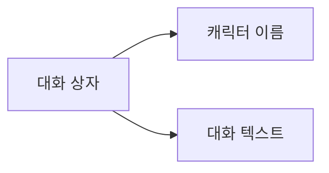

# 일반 대화

## 기능 설명


일반 대화는 게임에서 자주 쓰이는 상호작용 방식입니다. 캐릭터와 플레이어 사이의 소통에 사용되며, 캐릭터 이름과 대화 텍스트를 통해 대화 내용을 표시합니다.

## 문법 구조

```text
[배우 식별자, 변수 또는 이름표 텍스트] "대화 텍스트" [음성 태그] [매개변수=값 ...]
```

## 매개변수 설명

| 매개변수 | 필수 | 예시 | 설명 |
|------|------|------|------|
| 화자 | 예 | `alice`, `$speaker` 또는 `"내레이터"` | 정적 배우, 배우 ID를 담은 변수 또는 텍스트 이름표 |
| 대화 텍스트 | 예 | `안녕, 내 이름은 앨리스야!` | 캐릭터가 말할 내용 |
| 음성 태그 | 아니요 | `alice_intro_01` | 음성 파일을 식별하는 선택 태그 |
| `speed` | 아니요 | `[speed=1.5]` | 이 줄의 타이핑 속도 배율이며 `0`보다 커야 합니다 |
| `interval` | 아니요 | `[interval=0.03]` | 글자당 표시 간격(초)이며 `speed`와 함께 사용할 수 없습니다 |

## 예시

```text
# 일반 대화
alice "안녕, 내 이름은 앨리스야!" alice_intro_01

# 이 줄의 타이핑 속도만 조정
alice "이 줄은 더 빠르게 표시됩니다." [speed=1.5]

# 대응하는 배우가 필요 없는 텍스트 이름표
"내레이터" "폭풍우가 점점 더 거세지고 있었다..."

# 임시 변수 또는 영구 변수로 배우 선택
set $speaker "alice"
set %current_speaker "alice"
$speaker "이 줄의 화자는 변수가 선택합니다."
%current_speaker "영구 변수도 화자로 사용할 수 있습니다."

# 이름표 텍스트 안에서 변수 보간
set $guest_index 2
"손님 $guest_index" "만나서 반갑습니다."
```

따옴표 없는 이름은 항상 배우 식별자이며 편집기에서 자동 완성, 검사, 이동, 이름 변경을 지원합니다. `$name`과 `%name`은 항상 임시 변수와 영구 변수이며 값은 비어 있지 않은 문자열 배우 ID여야 합니다. 변수가 없거나 형식이 잘못되면 같은 이름의 문자열로 대체하지 않고 실행 오류가 발생합니다. 따옴표로 감싼 화자는 항상 현지화 가능한 텍스트이며 `$name`, `%name` 보간을 지원하고, 빈 문자열로 이름표를 숨길 수 있습니다. 보간 변수가 없으면 원래 자리 표시자를 유지하고 경고를 출력합니다. 기존 `"alice" "..."` 형식도 계속 사용할 수 있고, 계산된 이름표가 배우 ID와 일치하면 자동 강조도 유지됩니다.
