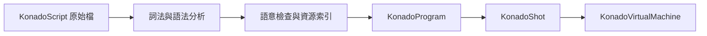

# 對話執行資料

KonadoScript 原始檔不會在執行階段逐行直譯。匯入或儲存 `.ks` 檔案時，編譯器會產生一組職責明確的執行資料。

## KonadoShot

`KonadoShot` 表示可載入的劇情鏡頭。它記錄來源檔案、鏡頭識別碼、資源相依性與本地化覆蓋層，並持有唯一的可執行產物 `KonadoProgram`。一般不需要手動建立；編輯器與執行階段載入器會負責更新它。

## KonadoProgram

`KonadoProgram` 是緊湊且唯讀的指令程式，儲存常數池、操作碼、運算元、控制流程位置、穩定指令鍵與原始碼行號。執行階段會依程式計數器直接執行這些陣列，不再建立舊式逐行對話物件。

## KonadoInstruction

`KonadoInstruction` 是程式內單一指令的唯讀檢視，不會複製底層資料，可供除錯、編輯器導覽與 .NET 整合使用。一般遊戲邏輯應透過 `KonadoDialogueManager` 驅動鏡頭，而不是自行走訪指令。

## 執行流程

此結構讓編譯期診斷、資源相依性檢查、執行階段回滾與本地化共用同一套穩定指令模型，同時避免重複解析腳本文字。
