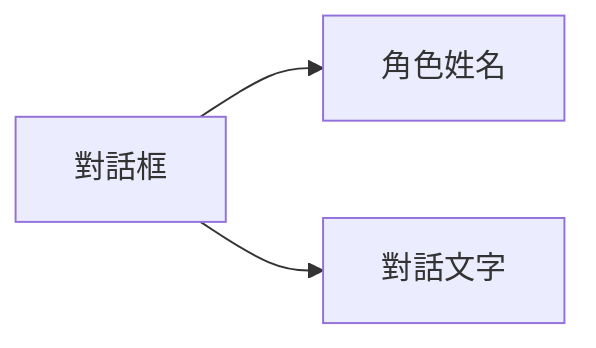

# 普通對話

## 功能描述


普通對話是遊戲中常見的互動方式，用於角色與玩家之間的交流，透過角色名稱、對話文字來呈現對話內容。

## 語法結構

```text
[演員識別碼、變數或署名文字] "對話文字" [配音標籤] [參數=值 ...]
```

## 參數說明

| 參數 | 必需 | 範例 | 說明 |
|------|------|------|------|
| 說話者 | 是 | `alice`、`$speaker` 或 `"旁白"` | 靜態演員、儲存演員 ID 的變數，或純文字署名 |
| 對話文字 | 是 | `你好，我叫愛麗絲！` | 角色要說的話 |
| 配音標籤 | 否 | `alice_intro_01` | 可選標籤，用於識別配音檔案 |
| `speed` | 否 | `[speed=1.5]` | 本句打字速度倍率，必須大於 `0` |
| `interval` | 否 | `[interval=0.03]` | 本句每個字元的打字間隔（秒），不可與 `speed` 同時使用 |

## 範例

```text
# 普通對話
alice "你好，我叫愛麗絲！" alice_intro_01

# 單獨調整本句的打字速度
alice "這一句會顯示得更快。" [speed=1.5]

# 純文字署名，不要求存在對應演員
"narrator" "暴風雨越來越猛烈了..."

# 使用暫存變數或持久變數動態選擇演員
set $speaker "alice"
set %current_speaker "alice"
$speaker "今天由變數決定誰在說話。"
%current_speaker "持久變數同樣可以作為說話者。"

# 帶插值的署名文字
set $guest_index 2
"訪客 $guest_index" "很高興見到你。"
```

裸名稱始終表示演員識別碼，編輯器可對其補全、檢查、跳轉與重新命名。`$name` 與 `%name` 始終表示暫存變數和持久變數，變數值必須是非空的字串演員 ID；變數不存在或類型錯誤時執行會失敗，不會回退成同名字串。帶引號的署名始終是可本地化文字，並支援 `$name`、`%name` 插值；使用空字串可隱藏署名，插值變數不存在時會保留原佔位符並輸出警告。舊版的 `"alice" "..."` 寫法仍可使用；署名與演員 ID 相同時，執行時仍可自動醒目提示該演員。
