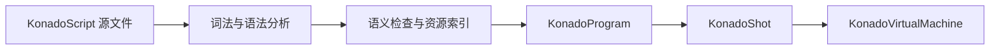

# 对话运行数据

KonadoScript 源文件不会在运行时被逐行解释。导入或保存 `.ks` 文件时，编译器会生成一组职责明确的运行数据。

## KonadoShot

`KonadoShot` 表示一个可加载的剧情镜头。它记录源文件、镜头标识、资源依赖和本地化覆盖层，并持有唯一的可执行产物 `KonadoProgram`。一般无需手动创建该资源；编辑器和运行时加载器会负责更新它。

## KonadoProgram

`KonadoProgram` 是紧凑、只读的指令程序，保存常量池、操作码、操作数、控制流位置、稳定指令键和源码行号。运行时直接按程序计数器执行这些数组，不再创建旧式的逐行对话对象。

## KonadoInstruction

`KonadoInstruction` 是程序中单条指令的只读视图。它不复制底层数据，可用于调试、编辑器导航和 .NET 集成。普通游戏逻辑应通过 `KonadoDialogueManager` 驱动镜头，而不是自行遍历指令。

## 执行流程

这种结构让编译期诊断、资源依赖检查、运行时回滚和本地化共享同一套稳定指令模型，同时避免运行时重复解析脚本文本。
