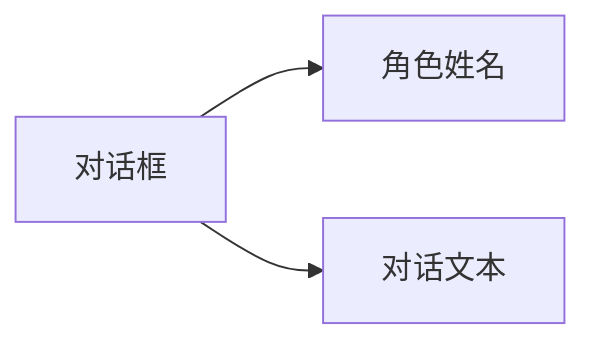

# 普通对话

## 功能描述


普通对话是游戏中常见的交互方式，用于角色与玩家之间的交流，通过角色名称、对话文本来呈现对话内容。

## 语法结构

```text
[演员标识符、变量或署名文本] "对话文本" [配音标签] [参数=值 ...]
```

## 参数说明

| 参数 | 必需 | 示例 | 说明 |
|------|------|------|------|
| 说话者 | 是 | `alice`、`$speaker` 或 `"旁白"` | 静态演员、保存演员 ID 的变量，或纯文本署名 |
| 对话文本 | 是 | `你好，我叫爱丽丝！` | 角色要说的话 |
| 配音标签 | 否 | `alice_intro_01` | 可选的标签，用于标识配音文件 |
| `speed` | 否 | `[speed=1.5]` | 本句打字速度倍率，必须大于 `0` |
| `interval` | 否 | `[interval=0.03]` | 本句每个字符的打字间隔（秒），不能与 `speed` 同时使用 |

设置了配音标签并成功播放语音时，对话框默认会显示音频进度；没有配音标签或语音播放结束后不会显示进度。如需关闭该功能，可以在对话框节点 `KonadoDialogueBox` 上关闭 `show_voice_progress`。进度显示样式可以在 `res://addons/konado/templates/default/voice_progress_display.tscn` 中自定义。

## 示例

```text
# 普通对话
alice "你好，我叫爱丽丝！" alice_intro_01

# 单独调整本句的打字速度
alice "这一句会显示得更快。" [speed=1.5]

# 纯文本署名，不要求存在对应演员
"narrator" "暴风雨越来越猛烈了..."

# 使用临时变量或持久变量动态选择演员
set $speaker "alice"
set %current_speaker "alice"
$speaker "今天由变量决定谁在说话。"
%current_speaker "持久变量同样可以作为说话者。"

# 带插值的署名文本
set $guest_index 2
"访客 $guest_index" "很高兴见到你。"
```

裸名称始终表示演员标识符，编辑器可以对其补全、检查、跳转和重命名。`$name` 与 `%name` 始终表示临时变量和持久变量，变量值必须是非空的字符串演员 ID；变量不存在或类型错误时运行会失败，不会回退成同名字符串。带引号的署名始终是可本地化文本，并支持 `$name`、`%name` 插值；使用空字符串可隐藏署名，插值变量不存在时会保留原占位符并输出警告。旧版的 `"alice" "..."` 写法仍可使用；当署名与演员 ID 相同时，运行时仍可自动高亮该演员。
